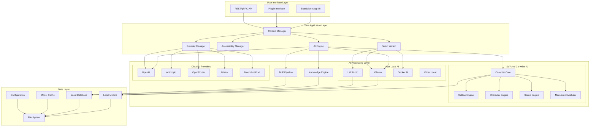

# Design Document

## Overview

The SoYume AI Creative Assistant is architected as a modular, cross-platform desktop application with plugin capabilities. The system employs a layered architecture that separates core AI logic, data management, and user interfaces to enable both standalone operation and seamless integration with host applications like SoYume Studio.

The design prioritizes offline-first operation through embedded AI models, local data storage, and comprehensive caching strategies, while providing optional cloud enhancement capabilities. Universal accessibility is built into every layer, from the core API design to the user interface components.

## Architecture

### High-Level System Architecture



### Core Components

#### 1. Context Manager
- **Purpose**: Central orchestration of user requests and system state
- **Responsibilities**: 
  - Route requests between UI layers and processing engines
  - Maintain session context and user preferences
  - Coordinate between accessibility features and core functionality
  - Manage plugin lifecycle and communication

#### 2. AI Engine
- **Purpose**: Core AI processing and model management
- **Responsibilities**:
  - Coordinate between SoYume Co-writer AI, user local AI, and cloud providers
  - Manage model loading, caching, and inference across all AI tiers
  - Route requests to appropriate AI based on task type and user preferences
  - Handle story analysis, character modeling, and scene generation
  - Provide consistent API regardless of underlying AI provider

#### 5. SoYume Co-writer AI
- **Purpose**: Specialized local AI trained specifically for creative writing tasks
- **Responsibilities**:
  - Handle core creative writing functions (outlining, character analysis, scene structure)
  - Provide instant, offline responses for primary workflows
  - Maintain story context and character consistency across sessions
  - Analyze imported manuscripts and extract story elements
  - Serve as the primary "creative partner" for writers

#### 3. Provider Manager
- **Purpose**: Abstract AI provider implementations and manage connections
- **Responsibilities**:
  - Handle authentication and connection management for cloud providers
  - Manage local AI installation and configuration
  - Provide failover and load balancing between providers
  - Execute setup wizard functionality

#### 4. Accessibility Manager
- **Purpose**: Ensure universal accessibility across all system interactions
- **Responsibilities**:
  - Manage TTS/STT functionality
  - Handle keyboard navigation and screen reader integration
  - Provide customizable UI layouts and focus management
  - Coordinate with assistive technologies

## Components and Interfaces

### AI Provider Abstraction Layer

```typescript
interface AIProvider {
  name: string;
  type: 'cowriter' | 'local' | 'cloud';
  capabilities: AICapability[];
  priority: number; // Higher priority for specialized tasks
  
  initialize(config: ProviderConfig): Promise<void>;
  generateText(prompt: string, context: StoryContext): Promise<AIResponse>;
  analyzeStory(content: string): Promise<StoryAnalysis>;
  generateCharacter(traits: CharacterTraits): Promise<Character>;
  isAvailable(): boolean;
}

// SoYume Co-writer AI - Specialized for creative writing
interface CowriterAI extends AIProvider {
  type: 'cowriter';
  
  // Core creative writing functions
  generateOutline(premise: string, structure: StoryStructure): Promise<Outline>;
  analyzeManuscript(content: string): Promise<ManuscriptAnalysis>;
  extractCharacters(content: string): Promise<Character[]>;
  suggestSceneStructure(context: SceneContext): Promise<SceneOutline>;
  checkCharacterConsistency(character: Character, scenes: Scene[]): Promise<ConsistencyReport>;
  
  // Specialized creative intelligence
  identifyPlotHoles(story: Story): Promise<PlotIssue[]>;
  suggestForeshadowing(story: Story): Promise<ForeshadowingSuggestion[]>;
  analyzePacing(chapters: Chapter[]): Promise<PacingAnalysis>;
}

interface ProviderConfig {
  apiKey?: string;
  endpoint?: string;
  modelName?: string;
  localPath?: string;
  parameters?: Record<string, any>;
}
```

### Story Intelligence Components

```typescript
interface StoryAnalyzer {
  analyzeStructure(content: string): Promise<StructureAnalysis>;
  detectPlotHoles(story: Story): Promise<PlotIssue[]>;
  analyzePacing(chapters: Chapter[]): Promise<PacingAnalysis>;
  checkConsistency(story: Story): Promise<ConsistencyReport>;
}

interface CharacterEngine {
  createCharacter(traits: CharacterTraits): Promise<Character>;
  analyzeRelationships(characters: Character[]): Promise<RelationshipMap>;
  generateDialogue(character: Character, context: SceneContext): Promise<string>;
  validateCharacterVoice(dialogue: string, character: Character): Promise<VoiceAnalysis>;
}

interface SceneGenerator {
  generateScene(prompt: ScenePrompt): Promise<Scene>;
  enhanceAtmosphere(scene: Scene, mood: Mood): Promise<Scene>;
  choreographAction(actionSequence: ActionPrompt): Promise<ActionScene>;
  generateSensoryDetails(setting: Setting): Promise<SensoryDescription>;
}
```

### Plugin Architecture

```typescript
interface PluginHost {
  registerPlugin(plugin: CreativeAssistantPlugin): void;
  sendMessage(message: PluginMessage): Promise<PluginResponse>;
  getContext(): HostContext;
}

interface CreativeAssistantPlugin {
  initialize(host: PluginHost): Promise<void>;
  processRequest(request: AIRequest): Promise<AIResponse>;
  getCapabilities(): PluginCapability[];
  shutdown(): Promise<void>;
}
```

### Accessibility Interface

```typescript
interface AccessibilityService {
  enableScreenReader(): void;
  configureTextToSpeech(config: TTSConfig): void;
  setupKeyboardNavigation(shortcuts: KeyboardShortcut[]): void;
  applyDyslexiaSupport(enabled: boolean): void;
  setFocusMode(mode: FocusMode): void;
  customizeLayout(layout: LayoutConfig): void;
}
```

## Data Models

### Core Story Models

```typescript
interface Story {
  id: string;
  title: string;
  genre: Genre[];
  structure: StoryStructure;
  characters: Character[];
  chapters: Chapter[];
  metadata: StoryMetadata;
  analysisCache: AnalysisCache;
}

interface Character {
  id: string;
  name: string;
  archetype: CharacterArchetype;
  traits: CharacterTraits;
  relationships: Relationship[];
  developmentArc: CharacterArc;
  voiceProfile: VoiceProfile;
}

interface Scene {
  id: string;
  chapterId: string;
  setting: Setting;
  characters: string[];
  mood: Mood;
  purpose: ScenePurpose;
  content: string;
  analysis: SceneAnalysis;
}
```

### Configuration Models

```typescript
interface UserPreferences {
  accessibility: AccessibilitySettings;
  aiProviders: ProviderPreference[];
  interface: InterfaceSettings;
  privacy: PrivacySettings;
  workflow: WorkflowSettings;
}

interface AccessibilitySettings {
  screenReader: boolean;
  textToSpeech: TTSSettings;
  dyslexiaSupport: boolean;
  focusMode: FocusMode;
  keyboardNavigation: boolean;
  customLayout: LayoutConfig;
}
```

### Local Database Schema

```sql
-- Stories and content
CREATE TABLE stories (
  id TEXT PRIMARY KEY,
  title TEXT NOT NULL,
  genre TEXT,
  structure_data TEXT,
  metadata TEXT,
  created_at TIMESTAMP,
  updated_at TIMESTAMP
);

-- Characters with encrypted sensitive data
CREATE TABLE characters (
  id TEXT PRIMARY KEY,
  story_id TEXT,
  name TEXT NOT NULL,
  archetype TEXT,
  traits_data TEXT,
  voice_profile TEXT,
  FOREIGN KEY (story_id) REFERENCES stories(id)
);

-- AI analysis cache
CREATE TABLE analysis_cache (
  content_hash TEXT PRIMARY KEY,
  analysis_type TEXT,
  result_data TEXT,
  created_at TIMESTAMP,
  expires_at TIMESTAMP
);

-- User preferences and settings
CREATE TABLE user_settings (
  key TEXT PRIMARY KEY,
  value TEXT,
  updated_at TIMESTAMP
);
```

## Error Handling

### Error Classification System

```typescript
enum ErrorType {
  AI_PROVIDER_ERROR = 'ai_provider_error',
  LOCAL_MODEL_ERROR = 'local_model_error',
  DATA_ACCESS_ERROR = 'data_access_error',
  PLUGIN_ERROR = 'plugin_error',
  ACCESSIBILITY_ERROR = 'accessibility_error',
  NETWORK_ERROR = 'network_error',
  VALIDATION_ERROR = 'validation_error'
}

interface ErrorHandler {
  handleError(error: SystemError): Promise<ErrorResolution>;
  getRecoveryOptions(error: SystemError): RecoveryOption[];
  logError(error: SystemError): void;
}
```

### Graceful Degradation Strategy

1. **AI Provider Failures**: Automatically fallback to alternative providers or local models
2. **Network Issues**: Continue with offline-only functionality
3. **Model Loading Errors**: Provide simplified analysis with cached knowledge
4. **Plugin Failures**: Isolate plugin errors from core functionality
5. **Accessibility Failures**: Maintain basic accessibility with fallback options

### User-Facing Error Messages

- Clear, non-technical language explaining what went wrong
- Specific recovery actions the user can take
- Alternative workflows when primary features are unavailable
- Progress indicators for automatic recovery attempts

## Testing Strategy

### Unit Testing
- **AI Engine Components**: Mock AI providers for consistent testing
- **Data Layer**: Test encryption, caching, and database operations
- **Accessibility Features**: Automated accessibility compliance testing
- **Plugin Interface**: Test plugin loading, communication, and isolation

### Integration Testing
- **Provider Integration**: Test with actual AI provider APIs and local models
- **Cross-Platform**: Automated testing on Windows, macOS, and Linux
- **Plugin Compatibility**: Test with SoYume Studio integration
- **Performance**: Load testing with large stories and multiple concurrent operations

### Accessibility Testing
- **Screen Reader Compatibility**: Test with NVDA, JAWS, and VoiceOver
- **Keyboard Navigation**: Comprehensive keyboard-only testing
- **Visual Accessibility**: Color contrast, font scaling, and layout testing
- **Cognitive Accessibility**: User testing with neurodivergent participants

### User Acceptance Testing
- **Creative Writer Workflows**: Test with professional writers and editors
- **Neurodivergent User Testing**: Specific testing with ADHD, autistic, and dyslexic users
- **Performance Benchmarks**: Validate 3-second response time requirements
- **Cross-Platform Consistency**: Ensure identical functionality across platforms

### Security Testing
- **Data Encryption**: Verify local data protection and secure key management
- **Plugin Isolation**: Test plugin sandboxing and permission systems
- **Network Security**: Validate secure communication with cloud providers
- **Privacy Compliance**: Ensure no unauthorized data transmission

### Automated Testing Pipeline
- Continuous integration with cross-platform builds
- Automated accessibility scanning
- Performance regression testing
- Security vulnerability scanning
- Plugin compatibility matrix testing

## SoYume Co-writer AI Development Strategy

### Model Architecture Selection

**Base Model Options:**
1. **Llama 3.1 8B/13B** - Excellent reasoning, good for fine-tuning
2. **Mistral 7B/8x7B** - Strong performance, efficient inference
3. **Qwen 2.5** - Great for creative tasks, multilingual support
4. **Future OpenAI Open Source Model** - When available, likely best performance

**Recommended Approach:**
- Start with Llama 3.1 8B for development and testing
- Scale to 13B or larger models based on hardware requirements
- Prepare architecture to swap base models as better options become available

### Training Data Curation

**Core Datasets:**
1. **Story Structure Data**
   - Annotated examples of Save the Cat, Hero's Journey, Three-Act structure
   - Genre-specific story beats and pacing patterns
   - Light novel and manga narrative structures

2. **Character Development Data**
   - Character archetype descriptions and examples
   - Personality trait combinations and interactions
   - Character arc progressions and development patterns
   - Dialogue samples tagged by character personality

3. **Creative Writing Craft**
   - Writing advice from established authors and editors
   - Scene construction and pacing techniques
   - Foreshadowing and plot development examples
   - Genre conventions and trope analysis

4. **Manuscript Analysis Examples**
   - Annotated manuscripts with structural breakdowns
   - Plot hole identification and resolution examples
   - Character consistency analysis samples
   - Pacing and tension curve annotations

### Fine-tuning Strategy

**Phase 1: Foundation Training**
```python
# Pseudo-code for training pipeline
training_config = {
    "base_model": "meta-llama/Llama-3.1-8B",
    "dataset": "soyume_creative_writing_v1",
    "training_type": "full_fine_tune",
    "epochs": 3,
    "learning_rate": 2e-5,
    "batch_size": 4,
    "gradient_accumulation": 8
}
```

**Phase 2: Task-Specific Training**
- Separate fine-tuning for each core function:
  - Outline generation
  - Character analysis
  - Scene structure
  - Manuscript analysis

**Phase 3: Reinforcement Learning from Human Feedback (RLHF)**
- Collect feedback from beta users (writers, editors)
- Train reward models based on creative writing quality
- Apply PPO or similar RL techniques

### Model Optimization and Deployment

**Quantization Strategy:**
- Use 4-bit or 8-bit quantization for deployment
- Maintain FP16 precision for critical creative reasoning tasks
- A/B test quantized vs full precision performance

**Hardware Requirements:**
- **Minimum**: 8GB RAM, integrated GPU
- **Recommended**: 16GB RAM, dedicated GPU (RTX 4060 or better)
- **Optimal**: 32GB RAM, high-end GPU (RTX 4080/4090)

**Model Serving:**
```typescript
interface CowriterModelConfig {
  modelPath: string;
  quantization: '4bit' | '8bit' | 'fp16';
  maxTokens: number;
  temperature: number;
  topP: number;
  contextWindow: number;
}
```

### Training Infrastructure

**Development Environment:**
- Use cloud GPUs (A100/H100) for initial training
- Implement distributed training for larger models
- Set up automated evaluation pipelines

**Data Pipeline:**
```python
# Training data preparation
class CreativeWritingDataset:
    def __init__(self):
        self.story_structures = load_structure_data()
        self.character_data = load_character_data()
        self.manuscript_examples = load_manuscript_data()
        
    def create_training_examples(self):
        # Convert raw data into instruction-following format
        examples = []
        
        # Outline generation examples
        for story in self.story_structures:
            examples.append({
                "instruction": "Create a detailed outline for this story premise:",
                "input": story.premise,
                "output": story.outline
            })
            
        # Character analysis examples
        for char in self.character_data:
            examples.append({
                "instruction": "Analyze this character's personality and motivations:",
                "input": char.description,
                "output": char.analysis
            })
            
        return examples
```

### Evaluation Metrics

**Automated Metrics:**
- BLEU/ROUGE scores for text generation quality
- Semantic similarity for character consistency
- Structure adherence for outline generation
- Factual accuracy for story analysis

**Human Evaluation:**
- Creative quality ratings from writers
- Usefulness scores for suggestions
- Accuracy of plot hole detection
- Character voice consistency ratings

### Continuous Improvement

**Feedback Loop:**
1. Collect user interactions and feedback
2. Identify common failure modes
3. Create targeted training data
4. Retrain specialized model components
5. A/B test improvements with users

**Version Management:**
- Maintain multiple model versions
- Allow users to choose model version
- Gradual rollout of new models
- Fallback to previous versions if issues arise

### Integration with External AI

**Hybrid Routing Logic:**
```typescript
class AIRouter {
  routeRequest(request: AIRequest): AIProvider {
    // Core creative tasks -> SoYume Co-writer
    if (request.type in ['outline', 'character_analysis', 'scene_structure']) {
      return this.cowriterAI;
    }
    
    // Complex generation -> User's preferred external AI
    if (request.type === 'prose_generation' && request.length > 1000) {
      return this.getPreferredCloudAI();
    }
    
    // Research tasks -> Cloud AI with web access
    if (request.type === 'research') {
      return this.getCloudAIWithWeb();
    }
    
    // Default to co-writer for creative tasks
    return this.cowriterAI;
  }
}
```

This approach gives you a specialized AI that becomes the "brain" of your application while still maintaining all the external AI flexibility you want.